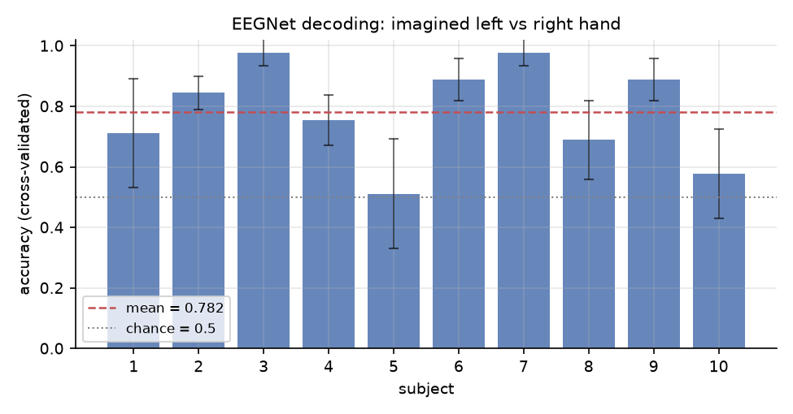
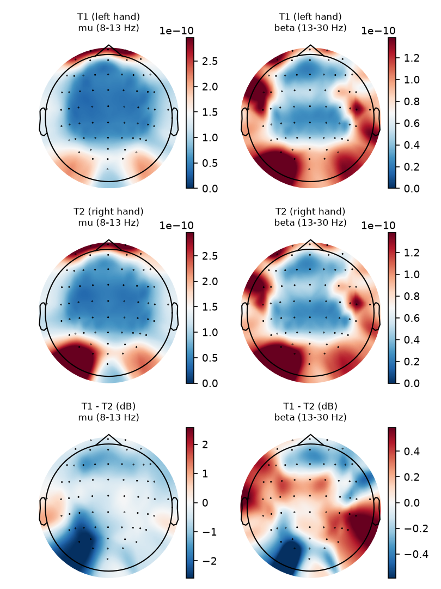
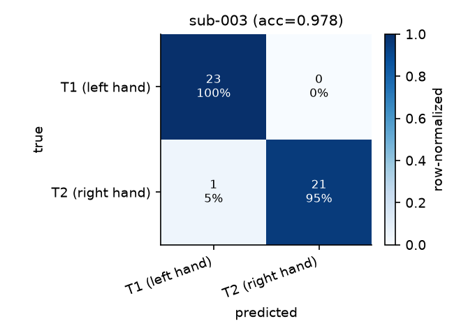
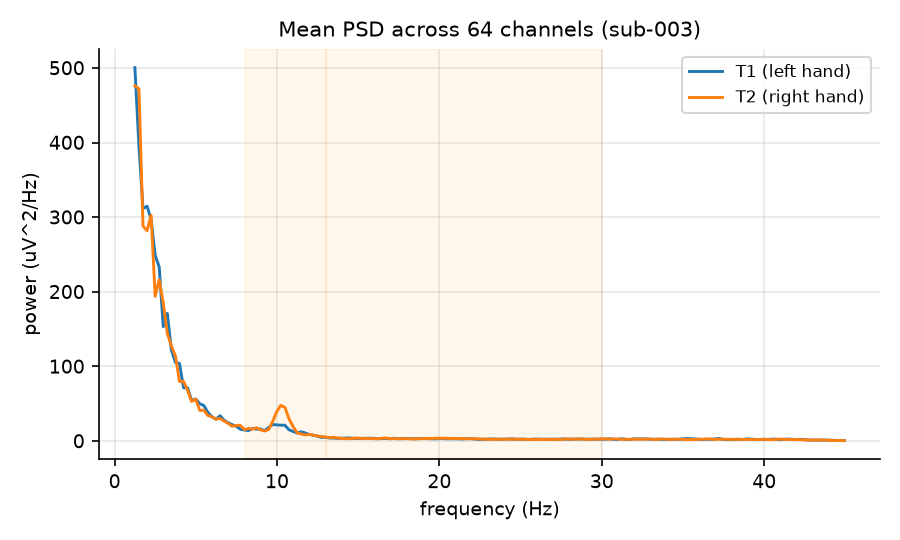

# EEGNet 脑电解码：想象左手 vs 想象右手

[](https://github.com/SANZAAAAA/EEGLearning/actions/workflows/ci.yml)

用 **EEGNet**(Lawhern et al., 2018) 对脑电信号做二分类解码的完整流程：
自动下载公开数据集 → 预处理 → 训练 → 交叉验证评估 → 输出图表与报告。

---

## 1. 数据集

**PhysioNet EEG Motor Movement/Imagery Dataset (EEGMMIDB)**

| 项目 | 说明 |
| --- | --- |
| 来源 | https://physionet.org/content/eegmmidb/1.0.0/ |
| 规模 | 109 名被试，每人 14 个 run |
| 采集 | 64 导联（10-10 系统），160 Hz 采样率 |
| 任务 | run 4/8/12：提示 **T1 = 想象左手握拳，T2 = 想象右手握拳** |
| 试次 | 每个 run 15 个试次（T1/T2 交替出现）→ 每人 45 个试次，每类约 22–23 个 |

下载由 MNE 直接完成，**无需注册**，文件缓存在 `data/MNE-eegbci-data/` 下，重复运行不会重新下载。

> 想换成 BCI Competition IV 2a（9 名被试、4 类运动想象、250 Hz）等其它数据集，
> 只需改写 `eegnet/data.py` 里 `load_subject()` 的读取部分，返回同样格式的
> `X: (n_trials, n_channels, n_times)` 和 `y` 即可，训练部分完全不用改。

---

## 2. 环境

已在本项目内创建好 Python 3.12 虚拟环境 `.venv`（系统自带的是 3.14，暂时装不了 PyTorch）。

```bash
# 激活环境
source .venv/bin/activate

# 从零重建（可选）
UV_CACHE_DIR="$PWD/.uv/cache" UV_PYTHON_INSTALL_DIR="$PWD/.uv/python" \
  uv venv --python 3.12 .venv
UV_CACHE_DIR="$PWD/.uv/cache" uv pip install -r requirements.txt
```

---

## 3. 快速开始

```bash
source .venv/bin/activate

# 默认：下载数据 + 10 名被试 × 5 折交叉验证
python train_eegnet.py

# 冒烟测试（约 1 分钟）
python train_eegnet.py --subjects 1 --max-per-class 10 --epochs 20 --cv 2

# 完整实验 + 经典脑电分析图
python train_eegnet.py --subjects 1-109 --cv 5 --analysis

# 只下载数据
python train_eegnet.py --subjects 1-20 --download-only
```

常用参数：

| 参数 | 含义 |
| --- | --- |
| `--subjects 1-10` | 被试范围，支持 `1,3,5` 这种写法 |
| `--cv 5` | 分层 K 折交叉验证；`--cv 1` 改为单次留出划分 |
| `--epochs 150 --patience 30` | 最大训练轮数 / 早停耐心值 |
| `--l-freq 8 --h-freq 30` | 换成运动想象常用的 mu+beta 频段 |
| `--augment` | 训练时做时间平移 + 高斯噪声增强 |
| `--analysis` | 输出 PSD、mu/beta 频带功率地形图、C3/C4 侧化指数 |
| `--analysis-only` | 只重跑分析出图、不重新训练（秒级完成） |
| `--device mps` | 指定设备（默认自动选 MPS/CPU） |

> 设备说明：EEGNet 本身很小（本配置约 2.9k 参数），实测 MPS 的算子调度开销反而略高于 CPU，
> 两者耗时基本一致。脚本会自动探测 MPS，不可用时回退 CPU。

跑单元测试（不依赖真实数据，0.1 秒完成）：

```bash
python -m unittest discover -s tests -t . -v
```

---

## 4. 方法与流程

### 预处理

1. 读取 EDF，统一导联名并挂载标准 10-05 电极位置（`standard_1005`）
2. 平均参考（可关：`--reference none`）
3. 带通滤波 0.5–40 Hz（8–30 Hz 可选）
4. 按提示符切段：`0 – 4.0 s`，共 641 个时间点
5. 归一化：默认每个试次单独 z-score（`--normalization per_trial`）；
   `global` 则只用**训练集**统计量，避免信息泄漏

### 数据划分

- 默认**被试内**分层 5 折交叉验证，把所有折的预测拼成 out-of-fold 预测再算指标
- 每折内部再从训练集切 20% 作为验证集，用于早停（按验证 loss）
- `--cv 1` 时退化为一次分层留出划分（80% / 20%）

### 模型

```
输入 (1, 64, 641)
 ├─ Conv2d(1→8, kernel 1×80)     时间卷积，学频率滤波器
 ├─ BatchNorm → DepthwiseConv(64×1, D=2)  空间卷积，学空间模式
 ├─ BatchNorm → ELU → AvgPool(1×4) → Dropout(0.5)
 ├─ DepthwiseConv(1×20) + PointwiseConv(1×1) → 16 通道  可分离卷积
 ├─ BatchNorm → ELU → AvgPool(1×8) → Dropout(0.5)
 └─ Flatten → Linear(320→2)
```

约 2.5k 参数，Adam(lr=1e-3)，交叉熵损失，批大小 32。
每个被试独立训练一个模型（被试内解码，这是运动想象 BCI 的常规设定）。

---

## 5. 输出

```
results/run_<时间戳>/
├── config.json                  本次全部超参数
├── log.txt                      完整运行日志
├── summary.csv / summary.json     被试级指标 + 总体统计
├── summary_accuracy.png         每名被试准确率柱状图（含均值线）
├── sub-001/
│   ├── model.pt                 最优权重（交叉验证时为 model_foldK.pt）
│   ├── metrics.json             准确率/平衡准确率/kappa/AUC/混淆矩阵/每类 P-R-F1
│   ├── training_curves.png      损失与准确率曲线
│   ├── confusion_matrix.png     混淆矩阵（含行归一化百分比）
│   ├── oof_prob.npy, labels.npy 每折预测概率与真实标签
│   └── ...
└── analysis/                    （加了 --analysis 时）
    ├── sub-001_psd.png                 两类试次的平均功率谱
    ├── sub-001_band_power_topomaps.png mu/beta 频带功率地形图 + T1−T2 差异图
    ├── sub-001_lateralization.csv      C3/C4 mu 功率侧化指数
    └── summary_analysis.json           所有被试的频带功率 / 侧化汇总
```

---

## 6. 结果怎么读

- **随机水平 0.5**：二分类准确率高于 0.55 通常认为解码有效，0.6–0.7 是 EEGMMIDB 上单被试
  EEGNet 的常见水平（被试间差异很大，从接近随机到 0.9+ 都有）
- **kappa**：扣除机遇一致后的指标，比准确率更稳健
- **侧化指数**：想象左手时对侧（右侧 C4）mu 节律功率下降，`LI = (C4−C3)/(C4+C3)` 应偏正，
  可以作为"模型学到的确实是运动想象相关特征"的旁证

---

## 7. 本次运行结果（10 名被试，5 折交叉验证）

```bash
python train_eegnet.py --subjects 1-10 --cv 5 --epochs 150 --analysis \
  --run-name eegnet_mi_10subj
```

| 被试 | 准确率 | 平衡准确率 | kappa | AUC |
| --- | --- | --- | --- | --- |
| 1 | 0.711 | 0.710 | 0.421 | 0.830 |
| 2 | 0.844 | 0.844 | 0.688 | 0.927 |
| 3 | 0.978 | 0.977 | 0.955 | 0.982 |
| 4 | 0.756 | 0.754 | 0.509 | 0.862 |
| 5 | 0.511 | 0.509 | 0.018 | 0.480 |
| 6 | 0.889 | 0.890 | 0.777 | 0.984 |
| 7 | 0.978 | 0.978 | 0.956 | 0.998 |
| 8 | 0.689 | 0.687 | 0.375 | 0.755 |
| 9 | 0.889 | 0.890 | 0.777 | 0.968 |
| 10 | 0.578 | 0.577 | 0.154 | 0.577 |
| **平均** | **0.782 ± 0.161** | **0.782** | **0.563** | **0.836** |

（随机水平 0.5；总耗时 442 秒，CPU）

要点：

- **被试间差异极大**：从 0.51（几乎随机，sub-005）到 0.98（sub-003 / sub-007），
  这正是运动想象 BCI 的典型现象，也是为什么必须做被试内建模、逐被试看结果。
- 训练集 loss 很快降到 0（28 个训练试次对 2.9k 参数的模型来说太容易记住），
  靠验证集早停和 dropout 控制过拟合，所以不同折的最优 epoch 差别很大。
- 每个折只有 9 个测试试次，单折准确率的量化间隔是 1/9 ≈ 0.111，**不要过度解读单个被试的
  小数点**，要按被试看整体趋势。
- **生理合理性**：C3/C4 的 mu 频带侧化指数 `LI = (C4−C3)/(C4+C3)`，
  10 名被试中有 8 名满足「想象右手时 LI 更大」的预期方向，
  组平均差异 +0.132（中位数 +0.146）。说明模型之外，数据里本身带有可解释的运动想象成分。

产物在 `results/eegnet_mi_10subj/`：`summary.csv` / `summary.json` 是全部数字，
`summary_accuracy.png` 是被试级柱状图，每个 `sub-xxx/` 下有模型权重、指标 JSON、
训练曲线和混淆矩阵，`analysis/` 下是 PSD、频带功率地形图和侧化指数 CSV。

### 结果图

被试级解码准确率（虚线为 10 人平均，点线为随机水平）：



以表现最好的 sub-003 为例——mu / beta 频带功率地形图与 T1−T2 差异图：



同一被试的混淆矩阵与两类试次的平均功率谱：





---

## 8. 文件结构

```
EEGLearning/
├── README.md
├── requirements.txt
├── train_eegnet.py          主入口（下载 + 训练 + 评估 + 汇总）
├── eegnet/
│   ├── config.py            超参数 dataclass
│   ├── data.py              数据下载、预处理、切分、归一化
│   ├── model.py             EEGNet 模型
│   ├── engine.py            训练循环、早停、交叉验证、指标
│   ├── plots.py             训练曲线 / 混淆矩阵 / 汇总图
│   └── analysis.py          PSD、频带功率地形图、侧化指数
├── tests/
│   └── test_eegnet.py       单元测试（不依赖真实数据，0.1 秒跑完）
└── .github/workflows/
    └── ci.yml               CI：导入检查 + 单元测试 + 手动触发的数据冒烟训练
```

磁盘占用（供参考，可随时删掉重新生成）：

| 目录 | 大小 | 说明 |
| --- | --- | --- |
| `.venv` | ~905 MB | 虚拟环境（含 torch） |
| `.uv` | ~900 MB | uv 的包缓存，装完环境后可安全删除 |
| `data` | ~94 MB | 10 名被试的原始 EDF（30 个文件） |
| `results` | ~7 MB | 指标、模型权重、图表 |
